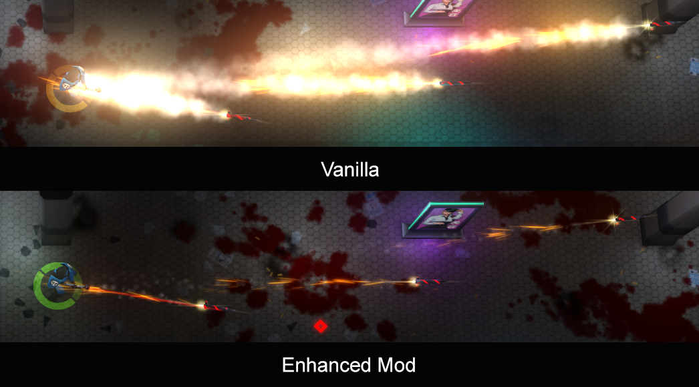

# JYDGE Enhanced (Mod)

A huge mod for the game JYDGE, by 10tons.

Includes all changes from [JYDGE Recalibrated](https://www.nexusmods.com/jydge/mods/2), by Illamasqua. Be sure to read that mod's description to see what else has changed.

## Overview

### New Stuff

- New Weapon (1)
- New Cyberware (8)
- New Gavel Mods (9)
- New Specials (2)

### New Features

- The level editor is now available from the main menu! ✨
- The Jydge has a new custom color scheme, inspired by Judge Dredd!
  - *Note: This might be moved to a standalone mod later.*

### Balancing

- Loads of weapons and perks have been altered to be more powerful or more interesting, create new synergies and builds, and make everything you unlock worth trying.
- The order of some Firemode unlocks has been changed, to make your Enhanced experience feel fresh, balance out some of the bigger weapon buffs, and give you a broader range of weapon types across a full playthrough.
- Extra love given to grenades and melee, with new and edited perks that make them more powerful.
- New HP-related perks grant chances to regain lost health, for players who find the game a little too punishing.
- Removed some OP vanilla perks (*Sickness, Fast Reload, Extended Magazine*).
  - These were so OP that they fit into any build, and not using them feels like playing with a major handicap.
  - Instead, this mods aims for balance across all items, so that nearly everything feels like a viable choice.

### Misc Tweaks

- Weapons and perks are now grouped into colours, making it easier to equip gear that matches your build.
- Rocket and ion FX are toned down. It's now much easier to see where to aim and dodge.
- Loads of QoL text changes.

### Extensively Tested

- I've played a full game with this mod, all the way up to Nightmare difficulty, and only upgrading weapons up to about half-way to ensure that you rarely need to grind.

## Costs

- Reduced costs of the last enhancement 2 slots.
  - Cyberware: 40k > 30k (Slot 4)
  - Gavel: 30k > 20k (Slot 3)
- Reduced costs of Specials.
  - Cost reductions are more drastic for early game unlocks, when players are likely to be saving for enhancement slots.
  - *Makes it easier and faster to try new Specials as you acquire them, without impacting your savings as much.*

## Firemodes

### New Firemode

- Laser Shotgun!
  - This is a cut weapon from the vanilla game files, now restored.
  - The game has a limit of 14 weapons, so 1 weapon had to be sacrificed. So I removed Plysma Spread (Plasma Shotgun), as Plasma Burst does something similar already.
  - The unused vanilla version is pretty weak. This new version has an improved fire rate, damage, and projectile count. It keeps its very long range.
  - Unlocks after 30 medals, instead of Rypid Plasma (Plasma SMG), which unlocks at 60 instead and is more powerful.

### Balance & Tweaks

- Lead Byllets + Shotgyn:
  - Now have 5 upgrade levels instead of 10.
  - *Aims to discourage wasting points with these weaker starter weapons.*
- Ion Rifle:
  - Raised medal requirement slightly (18 > 20).
  - *Makes it consistent with other weapons, as most of them unlock every 10 medals.*
- Rypid Plasma (Plasma SMG):
  - Increased damage: 12 > 16
  - Faster reload: 1.75 > 1.25
  - Now unlocks at 60 medals, instead of 30.
  - *Makes this flamethrower feel a lot more powerful.*
- Snyper:
  - Increase damage: 100 > 140
  - *Lets you score one-shots more reliably, and makes upgrades even more powerful.*
- Ion Spread (Ion Shotgun):
  - Base damage has been doubled (7 > 14).
  - Max targets: 2 > 4
  - Now unlocked after 100 medals, instead of 70.
  - *Ion weapons feel pretty weak in vanilla, especially with so few perks. This massive buff lets the Ion Shotgun contend with other late-game weapons.*
- Tiny Ryckets (Rocket Launcher):
  - Increased damage: 20 > 25
  - *Rockets now deal slightly more damage on impact.*
- Charged Shot:
  - Faster max charge time: 2 > 1.5
  - *Recalibrated already buffed this weapon, but charging still felt too slow fot the last weapon unlock. Now it's even more deserving of that final slot.*

### Unlocks

- Ion Rifle: Medals requirement: 18 > 20.
- Laser Shotgun: Unlocked at 30 medals.
- Rypid Plasma (Plasma SMG): Medals requirement: 30 > 60.
- Ion Spread (Ion Shotgun): Medals requirement: 70 100.
- Plysma Spread (Plasma Shotgun) has been removed, to make room for Laser Shotgun. It used to unlock at 60 medals.

## Specials

### New Abilities

  
<b><i>SPOILERS. Click to view the new Specials.</i></b>

| Name | Effect | Medals |
| ---- | ------ | ------ |
| Cluster Grenades | A mix of fire & regular grenades. | 23 |
| Antioch Grenades | Huge area of effect, high damage. Limited to only 2. | 113 |

### Balance & Tweaks

- Explosive Bolt:
  - Number of uses: 7 > 6.
  - Upgrading now increases the number of uses, insead of the damage.
  - *Explosive Bolts do roughly the same thing as the Grenade Launcher. This tweak makes them more unique, and gives you plenty of chances to miss your shots.*

## Cyberware

### New Cyberware

  
<b><i>SPOILERS. Click to view the new Cyberware.</i></b>

| Name             | Effect | Medals |
| ---------------- | ------ | ------ |
| Pyromaniac       | Immunity to fire damage. Fires you start have 4x burn time. | 34 |
| Vampire          | Drain HP from everything around you. | 54 |
| Faster Faster    | Time runs 2x faster, but you deal 1.5x damage. | 58 |
| Boss Killer      | Gain 20% increased damage to bosses. | 62 |
| Gib Profit       | Get 25 credits bonus for each body you gib with explosives. | 73 |
| DeSade           | Gain HP equal to 5% of damage done. | 91 |
| Clumsy           | Enemies have a 10% chance to drop a live grenade when they die. | 111 |
| Slowdown Field   | Enemies within the field walk slowly. Combos with Friend of Mine. | 142 |

### Balance & Tweaks

- Bullet Dodger:
  - Now also makes you turn instantly (in addition to slowing enemy projectiles).
  - *More control for a better chance to dodge those bullets.*
- Reaper:
  - Damage dealt to enemies with less than 50% HP is now increased by +20%, instead of being doubled.
  - *The vanilla version is just OP, effectively reducing all enemy HP to 75%. Now it's still powerful, but no longer feels like cheating.*
- GIANT!:
  - Increased melee knockback: 250% > 300%.
  - Updated text to show the full stats.
  - *Now all the stats are +300% (OCD satiated!). Also makes melee builds slightly more powerful.*
- Rita the Rocket Drone (Companion):
  - Shot interval 1 > 0.3, but clip size 1 > 3
  - *Can she now shoot a volley of 3 rockets at once! And the reduced fire rate means she's less likely to kill you.*
- (REMOVED) Sickness:
  - *Reducing enemy HP to half was just too OP.*

## Gavel Mods

### New Gavel Mods

  
<b><i>SPOILERS. Click to view the new Gavel Mods.</i></b>

| Name             | Effect | Medals |
| ---------------- | ------ | ------ |
| Accurate         | You gain Perfect accuracy with most non-shotgun weapons. | 18 |
| Active Reload    | Increases manual reload speed by 25%. | 26 |
| Armory           | Clip size is increased x8, but the extra weight slows you down to half speed. | 51 |
| Big Boomer       | Grenades fuse times are halved, and their explosive radius is increased by 50%. | 76 |
| No Fuse          | Grenades explode instantly. | 99 |
| Splinter Bullets | Your projectiles will split in two shortly after leaving the barrel. | 104 |
| Neon Lasers      | Fire rate is increased by 10x, but LASER damage is decreased by 60%. Non-Laser projectiles do ZERO damage. | 115 |
| Flaming Plasma   | Increases PLASMA damage by 40%. Plasma shots set enemies on fire, which may cause them to flee. | 145 |
| Triple Bangers   | Grenades you deploy spawn three small submunitions. | 150 |

### Balance & Tweaks

- Reload Plasma:
  - Increased the number of projectiles: 12 > 20
  - *It's too hard to hit anything with the vanilla version.*
- Power Gavel:
  - Extra effect: Now also gives +30% increase to melee speed.
  - *The vanilla version triples melee damage, but felt like it needed "Fast Melee" to be useful.*
- Melee Deflect:
  - Extra effect: You melee attacks hit everyone around you.
  - Renamed to "360 Deflect".
  - *Makes it much easier to deflect bullets.*
- Murderous Lead:
  - Reduced damage increase: +50% > +20%
  - Increased medals unlock cost: 42 > 124
  - Extra effect: Lead bullets now also pierce enemies.
  - *Lead bullets have plenty of perks, which just made every other gun feel weak by comparison, especially with how early this perk could be unlocked. This evens things out a bit. The new bonus effect makes is still worthwhile, trading the old higher damage for more utility.*
- (REMOVED) Fast Reload:
  - *Another perk that was just OP.*
- (REMOVED) Extended Magazine:
  - *Again, too OP. The new perk "Armory" fills its place.*

## Text Changes

**General**

- Mission End: Changed "Weapon Mods" to "Gavel Mods", to match the phrase used elsewhere.
- Pause Screen: Added a reminder/tip below the Restart button telling you to hold it to change your loadout on restart.

**Collectibles**

- Hints Now specify the required difficulty.
- Sin Eraser: Changed "Reset Sins" button text to say "View Reset Options".
- Sin Eraser: Expanded description to say "and optionally reset your mission progress (NG+)".
- C.A.T.S.: Hint expanded to say "who holds the key?".
- Time Recoil Comic: Added "by 25%" (note: this collectiable also increases move speed by 20%).

**Enhancement Descriptions**

- Health is now shown with a heart icon (in vanilla this is inconsistent).
- Credits are now shown with an icon.
- Green text highlights altered slightly to better show effects.
- Red text highlights have been added to show negative effects.
- Fast Melee: Expanded description to mention melee attack charge speed.
- GIANT!: Expanded description to specify stat change, and added hidden melee knockback stat.
- Damage Credits: Revised description to be clearer.

## Icon Colors

Most icons have new colours, and are grouped by theme/build. This should make it easier to set up a loadout with items that synergise well with each other.

**General**:

- $\color{rgb(25,125,255)}{\textsf{Attributes - Blue}}$
- $\color{rgb(255,125,125)}{\textsf{Civilians - Salmon}}$
- $\color{rgb(64,255,64)}{\textsf{Companions - Green}}$
- $\color{rgb(255,255,0)}{\textsf{Credits - Yellow}}$
- $\color{rgb(255,0,125)}{\textsf{Damage - Hot Pink}}$
- $\color{rgb(255,64,0)}{\textsf{Survival - Light Red}}$
- $\color{rgb(64,125,125)}{\textsf{Stealth - Dull Turqiose}}$
- $\color{rgb(255,25,255)}{\textsf{Misc - Pink}}$

**Weapons**:

- $\color{rgb(125,125,125)}{\textsf{Lead - Grey}}$
- $\color{rgb(255,215,0)}{\textsf{Plasma - Gold}}$
- $\color{rgb(255,25,25)}{\textsf{Laser - Red}}$
- $\color{rgb(125,255,255)}{\textsf{Ion - Cyan}}$

**Gavel Mods**:

- $\color{rgb(255,125,0)}{\textsf{General - Orange}}$
- $\color{rgb(255,0,0)}{\textsf{Melee - Red}}$

## Graphics (FX)

It's now easier to see where you're shooting, and what you're dodging.

- Projectile size halved for ion & enemy bullets.
  - *Their vanilla size makes their hitboxes look larger than they really are.*
- Rocket trails have much less smoke. Tiny Ryckets have less sparks too.
  - *It's now easier to see where rockets are, as the screen is less obscured by smoke.*

## Audio

- Added custom hurt sounds for the player character.
  - *Now you can tell when you're being hit vs. when an NPC is hit.*
  - *(note: pitch-shifted human male wi. some EQ)*
- Reduced the volume of the Shadow Cloak sound, down to 25%.

## Misc

- Added missing monospace font needed for the editor.
  - This font is taken from Dysmantle, so it's not perfect.

### Bugs

- Circle bug wi. slow field + vamp ring:
  - There's an issue with the AoE rings for both Vampire & Slowdown field.
  - Explosions & fire that overlap the rings will affect the player, even though they're outside of the player's hitbox.
  - However, there's an unexpected bonus to this: You can combo Friend of Mine with Slowdown field to convert mines from a long distance.
- There's no `damage_increase_per_damage_type` for explosions, creating a potential exploit with "Neon Lasers".

## Code Notes

### Important Files

Most of the changes start in these files:

- [data/abilities/abilities.xml](https://github.com/ithinkandicode/JYDGE-Enhanced-Mod/blob/main/data/abilities/abilities.xml)
- [data/enhancements/enhancements.xml](https://github.com/ithinkandicode/JYDGE-Enhanced-Mod/blob/main/data/enhancements/enhancements.xml) (see also: [enhancement-groups.xml](https://github.com/ithinkandicode/JYDGE-Enhanced-Mod/blob/main/data/jydge/enhancement-groups.xml))
- [data/jydge/weapons.xml](https://github.com/ithinkandicode/JYDGE-Enhanced-Mod/blob/main/data/jydge/weapons.xml)

New enhancement icons are in this folder, they're all prefixed with an underscore (`_`):

- [data/enhancements/icons](https://github.com/ithinkandicode/JYDGE-Enhanced-Mod/tree/main/data/enhancements/icons)

Also search for thse string: `MOD_EDIT` and `MOD_NEW`.

### Resources

- There's notes and stuff in the [notes](https://github.com/ithinkandicode/JYDGE-Enhanced-Mod/tree/main/notes) folder.
- Most edited files have comments with more info.
- [Spreadsheet](https://docs.google.com/spreadsheets/d/1EuM4p1FeFmHOt5FGKta02L1flK76pjaa2m91cLrdKTM/edit#gid=258290661) - Lists all the perks that have been added, plus a bunch of extra data I used and noted down when making this mod.

### Diff

To see the full code changes:

- https://github.com/ithinkandicode/JYDGE-Enhanced-Mod/compare/1.0.1...main (since vanilla)
- https://github.com/ithinkandicode/JYDGE-Enhanced-Mod/compare/1.0.2...main (since Recalibrated)

To do a local diff:

- Download the current code from the `main` branch
- Download the code from the release "[Vanilla - No Music](https://github.com/ithinkandicode/JYDGE-Enhanced-Mod/releases/tag/1.0.1)" (tag: 1.0.1)
- Diff them, eg with [WinMerge](https://winmerge.org/)

## @todo

- Reconsider the removed perks (Fast Reload, Sickness, Extended Magazine). Perhaps they could be retained with a smaller effect, plus a disadvantage?
  - Fast Reload: Change to "Light Clips", which increase reload speed but reduce clip size.
  - Extended Magazine: Chance +300% to +20%, and add a small debuff. (still needed if we have Armory?)
  - Sickness: Also reduce player health to half? Tricky to mod because it doesn't have an editable parameter, it's either ON or OFF.
- With Fast Reload & Extended Magazine removed, should weapons have their reload speeds and clip sizes buffed slightly to compensate?
